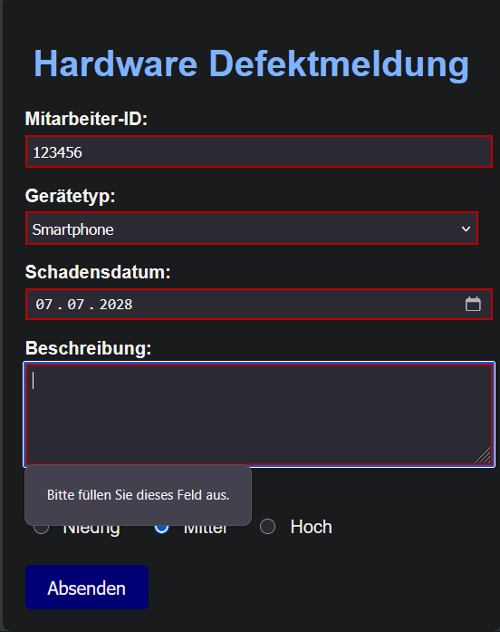
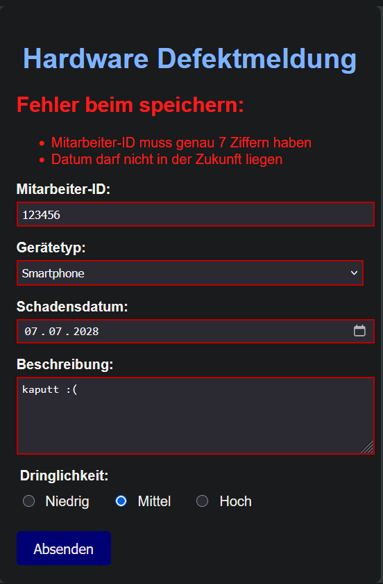
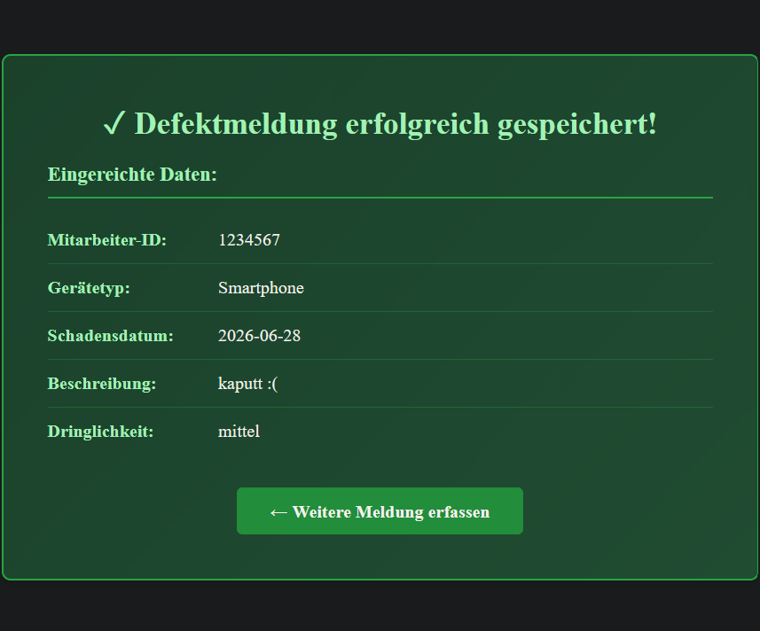
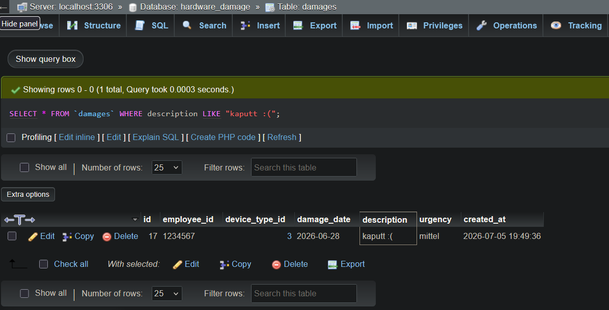

# Hardware Damage Report

# 🇩🇪🇦🇹🇨🇭 DE

## Beschreibung
Eine simple Web-Anwendung, welche ein Formular bereitstellt, um Hardwareschäden zu dokumentieren.
Zum ausführen der App auf dem eigenen PC, bitte den Anweisungen unter **Installation** folgen.

## Installation

1. Repository klonen:
    - git clone https://github.com/DimitriOrfanoudakis/flask-damage-report
    - cd flask-damage-report
2. Virtual Environent erstellen und aktivieren:
    - python -m venv venv 
    - (falls der Befehl mit python nicht funktioniert, bitte "python3 -m venv venv" probieren)
    - Windows(Command Prompt): venv\Scripts\activate.bat
    - Windows(Powershell): venv\Scripts\Activate.ps1
    - MacOS/Linux: source venv/bin/activate
3. Dependencies installieren:
    - pip install -r requirements.txt
4. Datenbank aufsetzen
    - mysql -u root -p -e "CREATE DATABASE hardware_damage;"
    - mysql -u root -p hardware_damage < hardware_schema.sql
    - Alternativ kann per XAMPP und phpMyAdmin eine Datenbank mit den namen "hardware_damage" erstellt werden.
    - Die erstellte Datenbank im phpMyAdmin anklicken und oben den sechsten Tab namens "Import" auswählen.
    - Hier kann die hardware_schema.sql manuell hochgeladen werden und die Datenbank wird initialisiert.
5. Environment Variable konfigurieren
    -den Inhalt der "env.example" Datei in eine Datei names ".env" kopieren und dort Username und Passwort hinzufügen.
6. App ausführen:
    - python app.py

## Nutzung
Eine genau 7-stellige Mitarbeiter-ID muss eingegeben werden. Anschließend werden Gerätetyp und Schadensdatum ausgewählt und eine kurze Beschreibung des Schadens verfasst.
Sollte eine oder mehrere Eingaben nicht korrekt sein, werden die entsprechenden Fehler angezeigt.

## Screenshots

### Keine Beschreibung eingegeben

### Ausgabe Validierungsfehler

### Ausgabe Speicherung Erfolgreich

### Eintrag in Datenbank erstellt

## Entwicklungsprozess
Dieses Projekt ging aus einer Übungsaufgabe hervor, welche als erster Berührungspunkt mit HTML, CSS und PHP diente.
Lernziel war vor allem den Umgang mit Formen und die Validierung ebendieser kennenzulernen. Die vom Benutzer eingegebenen Daten wurden durch die HTTP-Methoden GET und POST
an ein PHP-Skript übergeben, validiert und anschließend in einer Datenbank abgelegt.

Nachdem die App gut lief, entschied ich mich dazu, die HTML- und CSS-Dateien aus dieser Übung zu benutzen, um die App mit einem Web Framework anstelle von PHP umzusetzen.
Interessant fand ich hierfür zunächst vor allem Django, Flask und Laravel. 
Nach etwas Recherche entschied ich mich letztendlich für Flask, da ich mit Python bisher
mehr Erfahrung sammeln konnte, als mit PHP. 
Gegen Django entschied ich mich, da eine vorgegebene Projektstruktur und viele integrierte Features von Django mir eher passend
für größere und komplizierte Projekte erschienen und viele Quellen eher Flask als Einsteiger-Framework empfahlen.

Für die Datenbank habe ich weiterhin MariaDB über XAMPP verwendet und konnte die selbe Datenbank abwechselnd mit der PHP-App und der Flask-App ansprechen.

Verwendete Libraries:
- Flask als Web Framework
- Jinja2 als Templating Engine (in Flask enthalten)
- Werkzeug für Development Server, routet HTTP requests zwischen App und Browser (in Flask enthalten)
- Flask-MySQLdb um die MariaDB Datenbank zu verwalten
- dotenv um empfindliche Daten in .env Dateien zu speichern und aus diesen zu beziehen

Größte Herausforderung und Gelerntes:

Diverse Bugs beim anzeigen der Seiten, welche Aufmerksamkeit erforderten.
Besonders hinsichtlich der Datenstrukturen, welche von bestimmten Python-Methoden zurückgegeben werden.

Erste Auseinandersetzung mit Verwendung von Umgebungsvariablen für empfindliche Daten.
Übung in leichten CRUD-Operationen mit einer sehr simplen Datenbank.